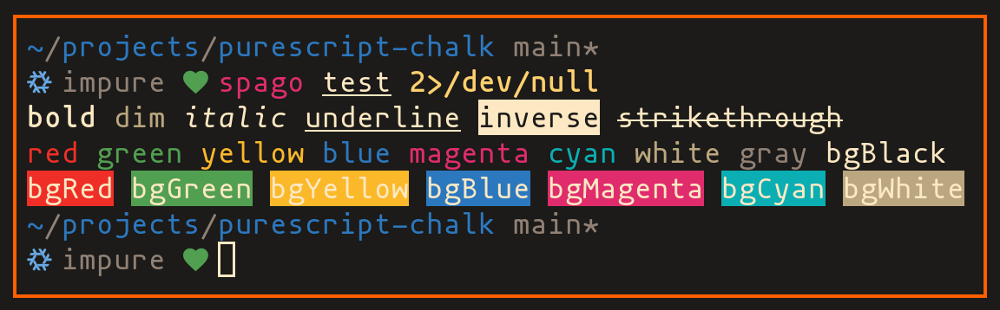

# purescript-choku

[Chalk](https://github.com/chalk/chalk) bindings for PureScript.

([Chōku][1] means chalk in Japanese.)

[![ci][b1]][b2]
[![release][b3]][b4]
[![pursuit][b5]][b6]
[![maintainer][b7]][b8]

[b1]: https://github.com/m15a/purescript-choku/actions/workflows/ci.yml/badge.svg
[b2]: https://github.com/m15a/purescript-choku/actions/workflows/ci.yml
[b3]: https://img.shields.io/github/release/m15a/purescript-choku.svg
[b4]: https://github.com/m15a/purescript-choku/releases
[b5]: https://pursuit.purescript.org/packages/purescript-choku/badge
[b6]: https://pursuit.purescript.org/packages/purescript-choku
[b7]: https://img.shields.io/badge/maintainer-m15a-teal.svg
[b8]: https://github.com/m15a/

## Example

```purescript
main = do
  let
    space = reset :& " "
    cr = reset :& "\n"
    end = reset :& ""

  log =<< bold          :& "bold"          <> space
       <> dim           :& "dim"           <> space
       <> italic        :& "italic"        <> space
       <> underline     :& "underline"     <> space
       <> inverse       :& "inverse"       <> space
       <> strikethrough :& "strikethrough" <> space

       <> black   :& "black"   <> cr
       <> red     :& "red"     <> space
       <> green   :& "green"   <> space
       <> yellow  :& "yellow"  <> space
       <> blue    :& "blue"    <> space
       <> magenta :& "magenta" <> space
       <> cyan    :& "cyan"    <> space
       <> white   :& "white"   <> space
       <> gray    :& "gray"    <> space

       <> bgBlack   :& "bgBlack"   <> cr
       <> bgRed     :& "bgRed"     <> space
       <> bgGreen   :& "bgGreen"   <> space
       <> bgYellow  :& "bgYellow"  <> space
       <> bgBlue    :& "bgBlue"    <> space
       <> bgMagenta :& "bgMagenta" <> space
       <> bgCyan    :& "bgCyan"    <> space
       <> bgWhite   :& "bgWhite"   <> end
```

prints like



## Installation

```console
$ npm install chalk
$ spago install choku
```

## License

[MIT](LICENSE)

[1]: https://en.wiktionary.org/wiki/%E3%83%81%E3%83%A7%E3%83%BC%E3%82%AF
